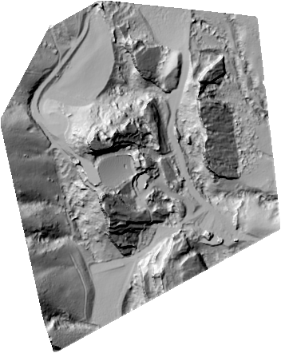

.. _quickstart:

******************************************************************************
Quickstart
******************************************************************************

Getting started with Entwine is easy with `Conda`_. Let's use Entwine
to fetch and organize some public data to a local index, serve it
into a Potree WebGL application, and extract a quick elevation
model and hillshade from it.

Installation
--------------------------------------------------------------------------------

Install `Miniconda`_ (or full Anaconda if you prefer) by visiting
https://conda.io/miniconda.html and downloading and running the install script
for your platform. Once you have installed Miniconda, run a
shell and create an Entwine environment:

::

   conda create -n entwine -c conda-forge entwine

This will create a new Conda environment, add the `Conda Forge`_
catalog to it, and install the entwine package from the Conda Forge
catalog.

Activate the ``entwine`` environment to use it:

::

   conda activate entwine

Building the data
--------------------------------------------------------------------------------

Make an output directory called ``red-rocks`` and use Entwine
to fetch it over the internet and build an `EPT`_ tree of it:

::

   mkdir red-rocks
   entwine build -i https://entwine.io/data/red-rocks.laz -o red-rocks

::

Now we have our output at ``red-rocks``. We could have also
passed a directory like ``-i ~/county-data/`` to index multiple files.
Now we can statically serve ``~/entwine`` with a simple HTTP server
and visualize it with a WebGL-based `Potree`_ or `Plasio`_ software.

Serving the data
--------------------------------------------------------------------------------

Conda makes it easy to grab other things, and so we'll grab
NodeJS and install ``http-server`` from it:

::

   conda install nodejs -y
   npm install http-server -g

Now move into the ``red-rocks`` directory and start up the
server

::

   cd red-rocks
   http-server -p 8080 --cors

.. note::

   We need to set the ``--cors`` option to allow our localhost
   http server to serve data to the remote Potree/Plasio
   pages.

With the server running, we can visit special Potree or Plasio
URLs that allow you to take in localhost URLs and visualize them:

* Plasio – http://dev.speck.ly/?s=0&r=ept://localhost:8080/&c0s=local://color
* Potree – http://potree.entwine.io/data/custom.html?r=http://localhost:8080/ept.json

Processing with PDAL
--------------------------------------------------------------------------------

We can also use the PDAL `EPT reader`_ to create an elevation model of the
data. Use PDAL to translate the service to a GeoTIFF using the `writers.gdal`_
driver:

::

   pdal translate ept://http://localhost:8080 red-rocks-dtm.tif --writers.gdal.resolution=2.0

That doesn't give us much to see, so let's create a `hillshade`_ using
`gdaldem`_:

::

   gdaldem hillshade red-rocks-dtm.tif hillshade.png

   Red Rocks Amplitheater (data from `DroneMapper <https://dronemapper.com/sample_data>`__).

.. seealso::

   For further information about how to configure Entwine - like reprojecting
   data, using configuration files and templates, enabling S3 capabilities, and
   producing `Cesium 3D Tiles`_ output - see the `Configuration`_ section.

.. _`gdaldem`: https://www.gdal.org/gdaldem.html

.. _`hillshade`: http://desktop.arcgis.com/en/arcmap/10.3/manage-data/raster-and-images/hillshade-function.htm
.. _`writers.gdal`: https://pdal.io/stages/writers.gdal.html
.. _Docker: http://docker.com
.. _`EPT reader`: https://pdal.io/stages/readers.ept.html
.. _`pipeline`: https://pdal.io/pipeline.html

.. _Conda Forge: https://conda-forge.org/
.. _`Conda`: https://conda.io/docs/
.. _Miniconda: https://conda.io/miniconda.html
.. _Potree: http://potree.org
.. _Plasio: https://github.com/hobu/plasio.js
.. _Cesium 3D Tiles: https://github.com/AnalyticalGraphicsInc/3d-tiles
.. _Configuration: https://entwine.io/configuration.html
.. _`EPT`: https://entwine.io/entwine-point-tile.html

